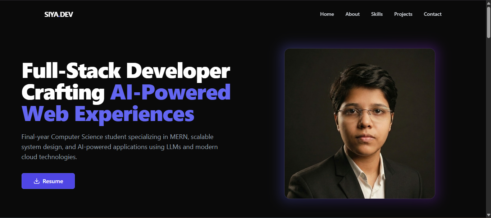

# 🚀 Siya.dev — Portfolio Website

A modern, responsive developer portfolio showcasing my work in **full-stack development and AI-powered applications**. Built with a focus on clean UI, performance, and scalability.

---

## ✨ Overview

This portfolio highlights my projects, technical skills, and experience as a **final-year Computer Science student** exploring **MERN stack and AI/LLM-based applications**.

It is designed to provide a seamless and engaging user experience while reflecting my development approach and technical capabilities.

---

## 🛠️ Tech Stack

- ⚛️ React.js  
- 🎨 Tailwind CSS  
- 🎞️ Framer Motion  
- 🧩 shadcn/ui  
- 🧠 AI / LLM Integrations  
- ☁️ Deployed on Vercel  

---

## 📌 Features

- ⚡ Smooth animations and modern UI  
- 📱 Fully responsive design  
- 🧠 AI-focused project showcase  
- 📄 Resume download functionality  
- 🎯 Clean and structured layout  

---

## 🚀 Live Demo

👉 [View Portfolio](https://portfolio-liard-delta-94.vercel.app/)

---

## 🖼️ Portfolio Preview

  

## 📬 Contact

- 💼 LinkedIn: https://www.linkedin.com/in/siya-srivastava-17bb15341  
- 📧 Email: siyasri19.14@gmail.com  

---

## ⭐ Acknowledgment

This portfolio is a continuous effort to learn, build, and improve — combining **modern web development** with **emerging AI technologies**.

---

> Built with passion, curiosity, and a focus on real-world impact 🚀
